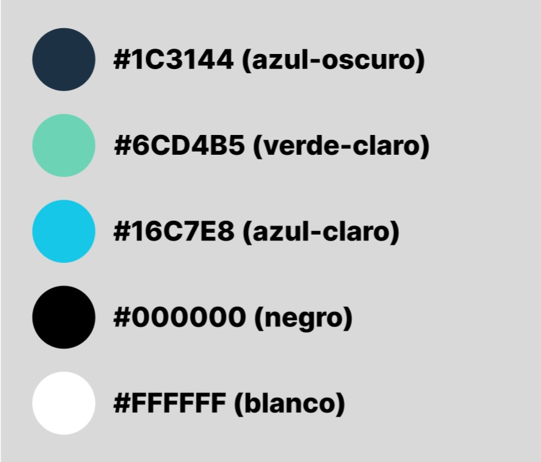

:toc: left 

= Proyecto GExpenses

== Introduccion

Este proyecto está elaborado por Joan Canals, Oscar Ramírez y Samuel García. El propósito central de nuestro proyecto es el desarrollo de una página web para gestionar las cuentas de un grupo de personas al realizar un viaje.

La página web  se llamará “GExpenses” y funcionará de la siguiente manera: primeramente, un usuario deberá crear una actividad, después deberá añadir a los integrantes correspondientes y finalmente introducirá los gastos de cada persona.

Para una buena navegación por la página web, se intentará crear un diseño cómodo, agradable y fácil de entender para todos usuarios que se conecten mediante una pantalla de ordenador convencional o un dispositivo móvil.

= Manual de instalación

Para que el usuario pueda hacer uso de nuestra aplicación primero deberá dirigirse a nuestro repositorio git y descargar nuestro proyecto.

https://git.copernic.cat/canals.ortiz.joan/gexpensesabp[Repositorio Git]

Una vez descargado, deberá acceder a este mediante un editor de codigo y dirigirse a la carpeta Vagrant. Dentro de esta, unicamente tendrá que ejecutari el comando "vagrant up" para levantar la máquina virtual. El proceso para la creación de la máquina puede demorar entre 2 a 4 minutos.

Cuando se haya creado el vagrant, solo quedará abrir un navegador web y poner la siguiente ip: 172.16.0.10.

= Manual de usuario

== Acceso a nuestro sitio web

Para acceder a nuestro sitio web, primeramente, el usuario debe crear una cuenta en nuestro formulario de registro. Una vez registrado, debe introducir sus credenciales en el formulario de login.

== Uso de nuestro sitio web

=== Creación de actividad

Una vez el usuario haya iniciado sesión, se le redirigirá a la página principal donde podrá crear las actividades. Para crear una actividad, deberá darle al botón "Añadir actividad" ubicado en la parte superior derecha de la página.

Una vez le da click, aparecerá un pop-up "Añade una actividad" donde el usuario podrá rellenar los siguientes campos: 

=== Detalle actividad

Una vez el usuario esté en nuestra Landing page se le mostrarán todas las actividades asociadas a dicho usuario, en ellas, podrá ver un pequeño resumen de la actividad. En la tarjeta aparecerá un botón “Details” donde si el usuario lo pulsa, se le redireccionará a la página de Detalles.

Cuando el usuario esté en esta página, se le mostrará un contenedor con varios campos. Por un lado tendrá la fecha en la que se creó la actividad. Por otro lado, encontrará una lista de los pagos realizados, así como una casilla con el importe de todos los gastos de esa actividad. 

También podrá consultar los usuarios que están en la actividad y por último, encontrará un botón “añadir gasto”.

    

=== Invitaciones

Dentro de la página de invitaciones, hallaremos un formulario donde podremos introducir el correo electrónico de la persona que queremos que se una a nuestra actividad.

Dependiendo de si el correo electrónico está registrado o no en nuestra base de datos, se enviará un mail de confirmación de la actividad o de registro.
En el mail de confirmación, encontraremos una url donde al hacer click, nos redirigirá a una pantalla de verificación, donde nos pedirá un código, el cual se encontrará ubicado en dicho mail. Una vez introducido el código, accederemos a la pantalla de detalles de la actividad a la que nos han invitado.

Si por el contrario, se envía un mail de registro, la url asociada a dicho mail redirigirá a la Landing Page de nuestra web, donde tendrá que registrar sus datos y hacer login para poder ver los detalles de la actividad a la cual ha sido invitado.

=== Pagos

Una vez el usuario haya pulsado el botón de “añadir gasto”,se le redirigirá a una página en la cual podrá crear un pago. Una vez en esa página el usuario deberá introducir un concepto de ese pago, un importe, deberá elegir un pagador y por último tendrá que elegir los miembros que participan en ese gasto. 

Una vez el usuario haya introducido estos datos, se le redirigirá a una página mediante el botón de “guardar” en la que se le mostrará una repartición por igual del importe que previamente ha seleccionado. En esta repartición aparecerán los usuarios que participan en el gasto y su proporción a pagar. 

Por último el usuario deberá pulsar el botón “aceptar”, para que se le redirigirá  a la página de detalles nuevamente, pero con el nuevo pago añadido a la “lista de pagos”.

= Guia de estilo

== Paleta de colores

Hemos elegido el azul como color principal, ya que hace un contraste que nos recuerda al cielo o al mar. Así como que transmite naturaleza y pureza. Creemos que un color así le dará un buen contraste según qué botones.

Por otro lado, elegimos el azul oscuro y el negro para así dar un toque de elegáncia y refinez.

Por último, elegimos el blanco para hacer un contraste y poder jugar con los colores más oscuros así como para poder aplicarlo en la letra.

== Texto

image::Texto1.jpg[]

image::Texto2.jpg[]

== Logo

image::Logo1.jpg[]

image::Logo2.jpg[]

== Botones

image::botones1.jpg[]

== Iconos

image::iconos1.jpg[]

== Pantallas

En este apartado mostraremos todos los diseños de las pantallas de nuestra aplicación.

.Tipo de pantallas:
[NOTE]
====
Cada pantalla tendrá sus respectivos apartados, tanto scketching, wireframe y mockup.

. Pantalla de login y registro.

. Pantalla Home y formulario.

====

En el siguiente enlace se muestran las pantallas: https://www.figma.com/file/F0jCsQDcN4v49yFDbC4XKK/GExpenses?node-id=0%3A1&t=Jf8ytj5PvDdSPTxb-1[Enlace de pantallas].

= Base de datos

== Diseño

Al diseñar la base de datos, hemos echo uso del lenguaje MySQL Workbench para crear las tablas y variables necesarias para que nuestra aplicación funcione.

las tablas principales que corresponden en nuestra base de datos son la tabla 'usuario', la tabla 'activitat' y la tabla 'invitacio' como se muestra en la siguiente imagen:

image::GExpensesBBDD.jpg[]

v2

image::GExpensesBBDD2.jpg[]

= Encriptar contraseña

La estratégia que hemos usado para encriptar la contraseña ha sido la siguiente:

1) Generar el hash de la contraseña mediante la función password_hash().

	$hash_password= password_hash($password,PASSWORD_DEFAULT);
 
2) Con la función password_verify(), comparamos el valor del password introducido por el usuario, con el mismo password convertido a hash.
   
   if (password_verify($passwordL,$user['contrasena'])) {
   	$_SESSION['usuario'] = $user['nombre'];
   	header("location: PHP/Home.php");
   } else {
   	echo '
    	
        	';
	}

= Vagrant

Vagrant es una herramienta que nos permite crear y configurar entornos de desarrollo virtualizados que se pueden ejecutar y compartir de forma sencilla.

Por ello, hemos creado un entorno Vagrant para configurar y compartir nuestra página web.

Para crear este entorno Vagrant, primeramente es necesario descargarse la herramienta en la página oficial:

https://developer.hashicorp.com/vagrant/downloads[Install Vagrant]

Una vez instalado, accedemos a nuestra area de trabajo y ejecutamos un comando para instalar nuestro entorno. En nuestro caso, usamos una maquina virtual Ubuntu:

    vagrant init ubuntu/bionic64
    vagrant up

Una vez generado nuestro entorno Vagrant, se generará un archivo Vagrantfile el cual contiene toda la informacion respecto a nuestra máquina virtual:

== Vagrantfile

    Vagrant.configure("2") do |config| 
      config.vm.box = "ubuntu/bionic64"
      config.vm.hostname = "GExpenses"
      config.vm.define "GExpenses"
      config.vm.network "private_network", ip: "172.16.0.10"
      config.vm.provision "shell", path: "script.sh"
      config.vm.provider "virtualbox" do |vb|
    	vb.name = "GExpenses44"
        vb.memory = "512"
        vb.cpus = 1
      end
    end

Para cumplir con los requisitos del Sprint 7 y crear un entorno Vagrant autoconfigurable en un entorno de producció con Apache, tuvimos que añadir la siguiente línia.

    config.vm.synced_folder "html/Code/", "/var/www/html"
    
Por lo tanto, el archivo VagrantFile quedaria de la siguiente forma:

    Vagrant.configure("2") do |config| 
      config.vm.box = "ubuntu/bionic64"
      config.vm.hostname = "GExpenses"
      config.vm.define "GExpenses"
      config.vm.synced_folder "html/Code/", "/var/www/html"
      config.vm.network "private_network", ip: "172.16.0.10" 
      config.vm.provision "shell", path: "script.sh"
      config.vm.provider "virtualbox" do |vb|
    	vb.name = "GExpenses43"
        vb.memory = "512"
        vb.cpus = 1
      end
    end

== Script.sh

Deberemos crear un archivo Script.sh para configurar los parametros de nuestro entorno Vagrant cuando se genere

    sudo apt-get update
    sudo apt-get ugrade
    
    #Instalamos la GuestAdditions
    sudo apt-get install virtualbox-guest-additions-iso
    
    #Instalamos MySql
    sudo apt-get install -y mysql-server
    sudo mysql < /vagrant/GExpensesBBDD.sql
    
    #Accedemos remotamente a la base de datos
    cp -f /vagrant/mysqld.cnf /etc/mysql/mysql.conf.d/mysqld.cnf 
    systemctl restart mysql

En el Sprint 7, para crear un entorno de Vagrant autoconfigurable en un entorno de producción, era necesario instalar Apache2 y PHP:

Apache:

    #Instalamos apache2
    sudo apt-get install apache2 -y
    sudo service apache2 restart

PHP8.1:

    #Instalamos PHP 8.1
    add-apt-repository ppa:ondrej/php
    apt-get install -y php8.1 php8.1-dev libapache2-mod-php8.1 libmcrypt-dev php8.1-mysql
    phpenmod mcrypt

En genenarl, el archivo script.sh quedaria de la siguiente forma:

    sudo apt-get update
    sudo apt-get ugrade
    #Instalamos apache2
    sudo apt-get install apache2 -y
    sudo service apache2 restart
    #Instalamos PHP 8.1
    add-apt-repository ppa:ondrej/php
    apt-get install -y php8.1 php8.1-dev libapache2-mod-php8.1 libmcrypt-dev php8.1-mysql
    phpenmod mcrypt
    #Instalamos la GuestAdditions
    #sudo apt-get install virtualbox-guest-additions-iso
    #Instalamos MySql
    sudo apt-get install -y mysql-server
    sudo mysql < /vagrant/GExpensesBBDD.sql
    #Accedemos remotamente a la base de datos
    cp -f /vagrant/mysqld.cnf /etc/mysql/mysql.conf.d/mysqld.cnf 
    systemctl restart mysql

== Conexion a la Base de Datos

Creacion de usuario:

    CREATE USER 'gexpensesuser'@'%' IDENTIFIED BY '1234';
    GRANT CREATE,ALTER,INSERT,UPDATE,SELECT,DELETE,DROP,REFERENCES, RELOAD  ON * . * TO 'gexpensesuser'@'%' WITH GRANT OPTION;
    FLUSH PRIVILEGES;

mysqld.cnf

= Conclusión

Como conslusión general del proyecto, nuestro grupo ha ido en todo momento atrasado, por lo cuál no hemos podido llevar a cabo todos los requerimentos propuesto en los diferentes sprints. 

Por una banda, hemos tenido muchas dificultades a lo largo del proyecto, aunque hemos podido resolver gran parte de ellos gracias a la ayuda del cuerpo docente y de las horas extras del horario establecido por la formación de ABP. 

Nuestro mayor problema ha sido , la mala coordinación y reparto de tareas entre los integrantes del grupo, aunque al final todos nosotros hemos ido tocando las diferentes áreas que se nos pedían, ya sea programació del lado del cliente o del servidor, gestionar la base de datos y el entorno Vagrant o otro tipo de tareas relacionadas con el diseño o documentació de nuestro sito web.

= Líneas futuras

= Glosario

== Repositorio Git

* https://git.copernic.cat/canals.ortiz.joan/gexpensesabp[Repositorio Git:]

== Enlaces a consultar

* https://es.stackoverflow.com/questions/98329/mostrar-mensaje-de-error-en-un-span-de-un-formulario-en-javascript[Mensasje de error]